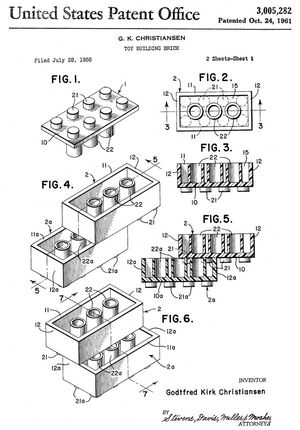

Connection Grammar
==================

Motivation
==========

Common Computer Usage
---------------------

- Management - Input, store, transfer, output
- Analysis - Search, machine learning, solvers

Design synthesis
----------------

> As engineering artifacts grow in complexity, we need to offload some design decisions to the computer. We need the computer to help us synthesize many of the minute details in our engineering devices as well as ensure high performance by searching among a myriad alternatives for the optimal combination of building blocks and parameter values [1]

---

---

[Computers in 2019](https://thisarticledoesnotexist.com/)

Context-free Grammars
=====================

Language Hierarchy
------------------

- Regular - Can be recognized finite state automata
- Context-free - Can be recognized by pushdown automata
- Recursively enumerable - Can be recognized by Turing machine

CFG Example
-----------

- S -> NP VP
- NP -> Adj Noun
- NP -> Noun
- VP -> Adj Verb
- VP -> Verb

---

Lindenmayer Systems
===================

Development
-----------

Used to model plant growth using grammar production rules

---

---

![Turtle Interpretation [3]](turtle-interpretation.png)

Interconnected Objects
----------------------

- Grammar rules represent valid ways that objects can be connected to one another
- Non-terminals are connection points
- Terminals are object placements

LEGO Example
============

---

Grammar Rules
-------------

- Stud -> 'Move(0,-1,0)' 'Place("Brick1x1")' Stud
- Stud -> ɛ

A Tower
-------

---

Stud

---

Move(0,-1,0) Place("Brick1x1") Stud

---

Move(0,-1,0) Place("Brick1x1") Move(0,-1,0) Place("Brick1x1") Stud

---

Move(0,-1,0) Place("Brick1x1") Move(0,-1,0) Place("Brick1x1") Stud

Capturing more connection options
---------------------------------

Grammar including rotation
--------------------------

- Stud -> 'Move(-2,0,0)' 'Rotate(90)' 'Move(-3,-3,-1)' 'Place(3001)' 'Move(-3,0,-1)' Stud
- Stud -> ɛ

---

Stud

---

Move(-2,0,0) Rotate(90) Move(-3,-3,-1) Place(3001) Move(-3,0,-1) Stud

---

Move(-2,0,0) Rotate(90) Move(-3,-3,-1) Place(3001) Move(-3,0,-1) Move(-2,0,0) Rotate(90) Move(-3,-3,-1) Place(3001) Move(-3,0,-1) Stud

---

Move(-2,0,0) Rotate(90) Move(-3,-3,-1) Place(3001) Move(-3,0,-1) Move(-2,0,0) Rotate(90) Move(-3,-3,-1) Place(3001) Move(-3,0,-1) Move(-2,0,0) Rotate(90) Move(-3,-3,-1) Place(3001) Move(-3,0,-1) Stud

Structure Fitness
=================

Limitations of grammars
-----------------------

Define syntax, not meaning

---

---

We need a way to determine the fitness of the meaning of an utterance to a particular purpose

Fill space
----------

- Use voxel-based collision detection

---

---

---

---

Future Work
===========

Grammars as machine learning models
-----------------------------------

> Do you know of any attempts to learn a connection grammar, instead of creating it by hand?

References
==========

---

- [1] Campbell, Matthew I., and Kristina Shea. “Computational Design Synthesis.” Artificial Intelligence for Engineering Design, Analysis and Manufacturing 28, no. 3 (2014): 207–8. doi:10.1017/S0890060414000171.

---

- [2] Lindenmayer, Aristid. "Mathematical models for cellular interactions in development I. Filaments with one-sided inputs." Journal of theoretical biology 18, no. 3 (1968): 280-299.

---

- [3] Bie, Dongyang, Jie Zhao, Xiaolu Wang, and Yanhe Zhu. "A distributed self-reconfiguration method combining cellular automata and L-systems." In Robotics and Biomimetics (ROBIO), 2015 IEEE International Conference on, pp. 60-65. IEEE, 2015.
