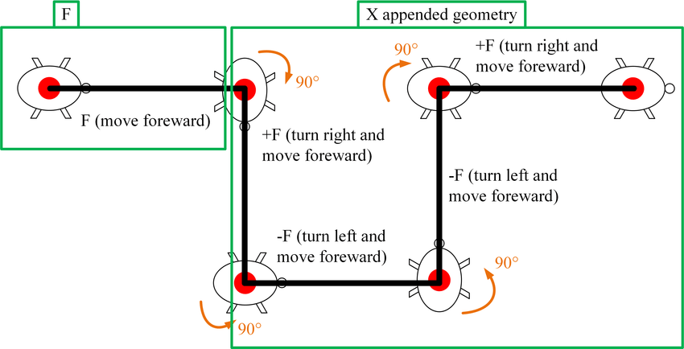
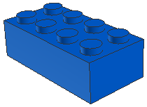
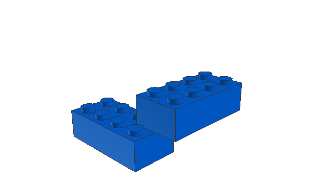
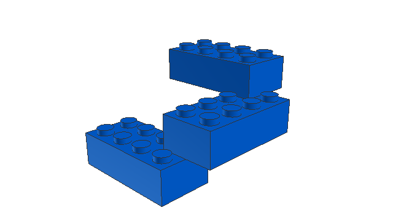
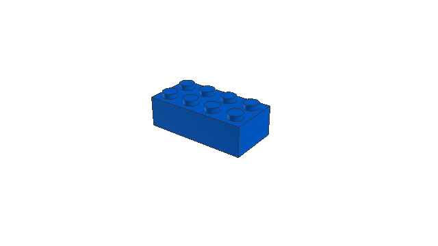
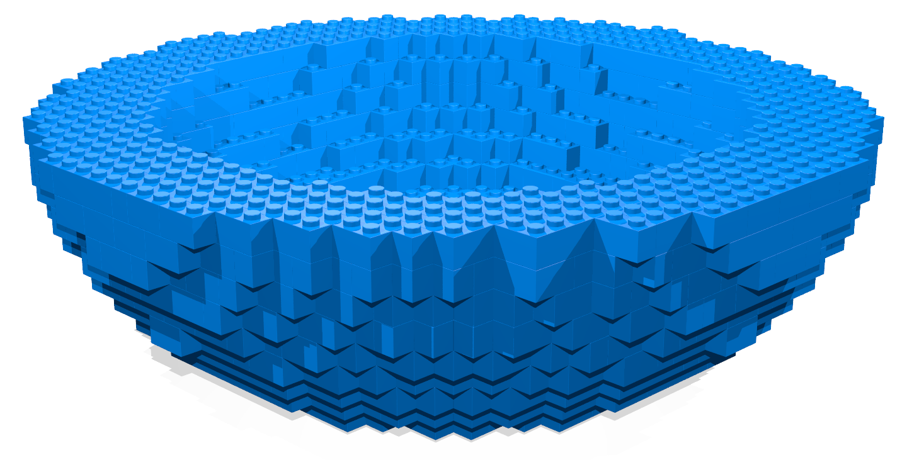
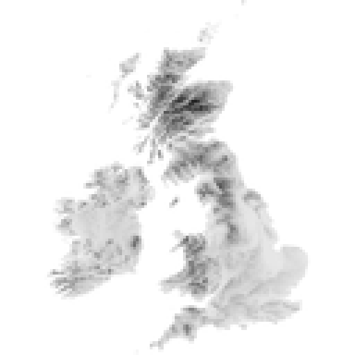
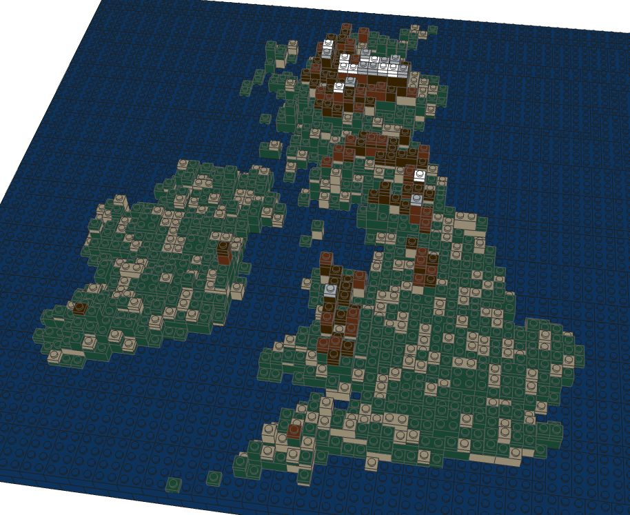

Connection Grammar
==================

[](https://travis-ci.com/jncraton/connectiongrammar)

This package provides a way to develop text grammars that represent a language of interconnected 3D objects in a Python environment.

Overview
--------

The field computational design synthesis involves using computer algorithm to create designs to meet a set of engineering requirements. There are many tools and algorithms available to aid in computational design synthesis[5]. Generative grammars are one broad class of solutions to this problem.

This project uses a context-free grammar to generate a language that issues commands to a 3D object printer. It moves and rotates an imaginary print head and issues requests to place objects. This is similar to the "turtle interpretation" for L-systems desribed in [3]:

> The  concept  is  based  on  the idea of an imaginary turtle that walks, turns and draws according to instructions given. At any time the turtle has a current position in  3-space  and  a  heading  vector  (the  forward  direction  of movement). Individual letters in a string are treated as commands. Different  letters  change  position  or  heading,  record  vertices  in  a polygon,  apply  pre-defined  surfaces  to  the  current  position  and orientation, change colour, etc.

A picture is worth a thousand words, so here is a graphical explaination from [7]:



While context-free grammars are suitable for modelling possible connections, they do not have a concept of global state and cannot "see" the rest of the generated objects. A second layer fitness function, modeling a user-defined global ruleset, is required to generate object graphs that adhere to specific global parameters. This is similar to the methods used in other work [1][2]. In the case of simple interconnected shapes, a 3D collision space may be a suitable fitness function to ensure a physically valid shape. Additional rules can be added to ensure that a generated shape is suitable in other ways. For example, rules could be added for thermal disipation to model behavior of various shapes for use as a heat exchangers.

The algorithm for fitting a model to the fitness function is as follows:

1. Initialize a list of symbols containing only the start symbol.
2. Find the left-most non-terminal symbol.
3. Generate a new text by applying a production rule that we have not tried yet.
4. Check the generated text against our fitness function and store the result.
5. Repeat back to (3) for each production rule.
6. Apply the production rule that returned the highest fitness (first rule wins in case of a tie).
7. Repeat back to (2) until the string contains only terminals.

Examples
--------

This package and basic algorithm could be used to model many kinds of interconnected structures. For demonstration purposes, I will explore interconnected stud-and-tube-based building blocks such as [4]:


This sort of system is familiar to most people. Using this for demonstration eliminates the need to describe external domain knowledge as part of an explaining this methodology. It also has the convienient side-effect of being a cheap physical object that can be quickly assembled for debugging and problem solving.

Despite its simple appearance, blocks of this nature to provide enough interesting behavior to demonstrate the complexity that can be generated using context-free grammars. For example, blocks may only be stacked, so in order to move laterally multiple blocks must be stacked in an interconnected pattern.

Brick Stacking Example
----------------------

Trivially, this system can be used to generate a stack of bricks. This simplistic example provides a good starting point for demonstration purposes.

### Program Generation

The following is a simple grammar that could be used to generate instructions for a basic brick tower:

    Stud -> 'Move(0,-1,0)' 'Place("Brick1x1")' Stud
    Stud -> ɛ

Adding a simple fitness function to return perfect fitness unless we have more than 3 bricks in the model will allow us to generate a placement program. Here are the steps for the generation process:

1. `Stud` (Start symbol in our grammar)
    - 0 Elements
    - Fitness: 1.0
2. `Move(0,-1,0) Place("Brick1x1") Stud`
    - 1 Element
    - Fitness: 1.0
3. `Move(0,-1,0) Place("Brick1x1") Move(0,-1,0) Place("Brick1x1") Stud`
    - 2 Elements
    - Fitness: 1.0
5. `Move(0,-1,0) Place("Brick1x1") Move(0,-1,0) Place("Brick1x1") Move(0,-1,0) Place("Brick1x1") Stud`
    - 3 Elements
    - Fitness: 1.0
6. `Move(0,-1,0) Place("Brick1x1") Move(0,-1,0) Place("Brick1x1") Move(0,-1,0) Place("Brick1x1") Move(0,-1,0) Place("Brick1x1") Stud`
    - 4 Elements
    - Fitness: 0.0
    - Our element list now contains more than three elements, so it fails our simple fitness test.
    - Therefore, we don't apply this production rule and instead try the next one.
7. `Move(0,-1,0) Place("Brick1x1") Move(0,-1,0) Place("Brick1x1") Move(0,-1,0) Place("Brick1x1")`
    - 3 Elements
    - Fitness: 1.0
    - We now have only terminals, so we have generated a complete valid program.

### Program Execution

Now that we have the program generated, let's step through the program execution. The only state we need to consider is the current postion and the list of placed elements:

1. Program initialization
    - position = (0,0,0)
    - elements = []
2. Execute `Move(0,-1,0)`
    - position = (0,-1,0)
    - elements = []
3. Execute `Place("Brick1x1")`
    - position = (0,-1,0)
    - elements = [("Brick1x1",0,-1,0)]
    - Rendered output: 
    
    
4. Execute `Move(0,-2,0)`
    - position = (0,-2,0)
    - elements = [("Brick1x1",0,-1,0)]
5. Execute `Place("Brick1x1")`
    - position = (0,-2,0)
    - elements = [("Brick1x1",0,-1,0), ("Brick1x1",0,-2,0)]
    - Rendered output: 
    
    
6. Execute `Move(0,-1,0)`
    - position = (0,-3,0)
    - elements = [("Brick1x1",0,-1,0), ("Brick1x1",0,-2,0)]
7. Execute `Place("Brick1x1")`
    - position = (0,-3,0)
    - elements = [("Brick1x1",0,-1,0), ("Brick1x1",0,-2,0), ("Brick1x1",0,-3,0)]
    - Final rendered output:
    
    

Rotation and Translation Example
--------------------------------

The stacking example represents some of the basic concepts, but it is a simplification of the complete system. In addition to the above instructions, this system also implements `Rotate` to adjust the direction of the head. `Move` instructions adjust position relative to head direction, and `Place` instructions use head direction also determine the orientation of placed objects. Positions are also stored on a stack and can be pushed and popped in order to simplify grammar and program design.

The state of a running program consists of:

1. A stack of head positions. This is initialized with one position at the origin. A position is represented as a 4-tuple (x, y, z, rotation_matrix). The rotation matrix is a standard 3x3 3D transformation matrix.
2. A list of elements. Elements are represented as a 3-tuple of (position, color, name).

Rotation and translation are important, as connections between these building block and many other physical objects depend on connections being made at specific locations and orientations. This applies in many contexts including screws lining up with associated holes in a connected part and surface-mount PCB connectors properly aligning with their mate. Including rotation and translation in our system allows us to model complex connection types in 3D space.
 
### Program Generation

Consider the following grammar that includes translation in the xz plane as well as head rotation:

    Stud -> 'Move(-2,0,0)' 'Rotate(90)' 'Move(-3,-3,-1)' 'Place(3001)' 'Move(-3,0,-1)' Stud
    Stud -> ɛ

Using the same simple fitness function as before to limit us to three elements, this grammar will generate the following placement program:

```
Move(-2,0,0)
Rotate(90)
Move(-3,-3,-1)
Place(3001)
Move(-3,0,-1)
Move(-2,0,0)
Rotate(90)
Move(-3,-3,-1)
Place(3001)
Move(-3,0,-1)
Move(-2,0,0)
Rotate(90)
Move(-3,-3,-1)
Place(3001)
Move(-3,0,-1)
```

Steping through the program will generate the following:

1. Execute `Move(-2,0,0) Rotate(90) Move(-3,-3,-1) Place("Brick2x4") Move(-3,0,-1)`



2. Execute `Move(-2,0,0) Rotate(90) Move(-3,-3,-1) Place("Brick2x4") Move(-3,0,-1)`



3. Execute `Move(-2,0,0) Rotate(90) Move(-3,-3,-1) Place("Brick2x4") Move(-3,0,-1)`



Complex Fitness Function Example
--------------------------------

The previous examples have used a trivial fitness function that could simply be replaced by "generate a string from the grammar of length n". A non-trivial fitness function should actually use to properties of the generated object to determine fitness.

One example would be a fitness function that validates legal collision-free element placement. This can be implemented using any physics simulator, but for simplicity we will simply use an axis-aligned bounding box (AABB) voxel system[8].

Let's begin by significantly expanding our grammar. We'll need two main additions:

1. The ability to add bounds to our geometery. We will implement this via a new `PlaceBoundingBox` operation.
2. The ability for placed elements to actually consume space. We will implement this via a new `FillRect` operation.

We will also use a greatly expanded grammar for element placement to demonstrate some of the power of this system. The grammars used can be found in the /grammar directory. Here is an example grammar that includes 1x1, 1x2, 2x2, and 2x4 bricks and implements both stud and antistud connections:

```
Stud -> '(' 'Move(-3,-3,-1)' B2x4 ')'
Stud -> '(' 'Move(-2,0,0)' 'Rotate(90)' 'Move(-3,-3,-1)' B2x4 ')'
Stud -> '(' 'Move(-2,0,0)' 'Rotate(270)' 'Move(-3,-3,-1)' B2x4 ')'
Stud -> '(' 'Move(-2,0,0)' 'Rotate(180)' 'Move(-3,-3,-1)' B2x4 ')'

Stud -> '(' 'Move(-1,-3,-1)' B2x2 ')'
Stud -> '(' 'Rotate(90)' 'Move(-1,-3,-1)' B2x2 ')'
Stud -> '(' 'Rotate(180)' 'Move(-1,-3,-1)' B2x2 ')'
Stud -> '(' 'Rotate(270)' 'Move(-1,-3,-1)' B2x2 ')'

Stud -> '(' 'Move(-1,-3,0)' B1x2 ')'
Stud -> '(' 'Rotate(90)' 'Move(-1,-3,0)' B1x2 ')'
Stud -> '(' 'Rotate(270)' 'Move(-1,-3,0)' B1x2 ')'
Stud -> '(' 'Rotate(180)' 'Move(-1,-3,0)' B1x2 ')'

Stud -> '(' 'Move(0,-3,0)' B1x1 ')'
Stud ->

Antistud -> '(' 'Move(-3,0,-1)' B2x4 ')'
Antistud -> '(' 'Move(-2,0,0)' 'Rotate(90)' 'Move(-3,0,-1)' B2x4 ')'
Antistud -> '(' 'Move(-2,0,0)' 'Rotate(270)' 'Move(-3,0,-1)' B2x4 ')'
Antistud -> '(' 'Move(-2,0,0)' 'Rotate(180)' 'Move(-3,0,-1)' B2x4 ')'

Antistud -> '(' 'Move(-1,0,-1)' B2x2 ')'
Antistud -> '(' 'Rotate(90)' 'Move(-1,0,-1)' B2x2 ')'
Antistud -> '(' 'Rotate(270)' 'Move(-1,0,-1)' B2x2 ')'
Antistud -> '(' 'Rotate(180)' 'Move(-1,0,-1)' B2x2 ')'

Antistud -> '(' 'Move(-1,0,0)' B1x2 ')'
Antistud -> '(' 'Rotate(90)' 'Move(-1,0,0)' B1x2 ')'
Antistud -> '(' 'Rotate(180)' 'Move(-1,0,0)' B1x2 ')'
Antistud -> '(' 'Rotate(270)' 'Move(-1,0,0)' B1x2 ')'
Antistud -> '(' B1x1 ')'
Antistud -> 

B2x4 -> 'FillRect(8,3,4)' 'Place(3001)' BrickConnection2x4
B2x2 -> 'FillRect(4,3,4)' 'Place(3003)' BrickConnection2x2
B1x2 -> 'FillRect(4,3,2)' 'Place(3004)' BrickConnection1x2
B1x1 -> 'FillRect(2,3,2)' 'Place(3005)' BrickConnection

BrickConnection -> '(' Stud 'Move(0,3,0)' Antistud ')' |
BrickConnection1x2 -> '(' 'Move(-1,0,0)' BrickConnection 'Move(2,0,0)' BrickConnection ')'
BrickConnection2x2 -> '(' 'Move(0,0,-1)' BrickConnection1x2 'Move(0,0,2)' BrickConnection1x2 ')'
BrickConnection2x4 -> '(' 'Move(-2,0,0)' BrickConnection2x2 'Move(4,0,0)' BrickConnection2x2 ')'
```

Let's run expand that grammar inside a bounding box:


We can see that the grammar is able to fill the entire bounding box with bricks in a legally connected structure. Let's try a bounding sphere to see if we are able to fill a structure that doesn't align quite so nicely to our axis-aligned voxel world:



That works fine as well. By combining bounding boxes and bounding spheres, we can build some fairly complex shapes, such as this dish:



Castle Example
--------------

Now let's try to actually make something that looks like a real-world object. Castle walls are recognizable, so let's start there.

Height Map Example
------------------

We can get creative with our fitness function in order to create all kinds of novel structures. For example, we could build a topographical map of an area by building a fitness function from a height map such as this one:



The fitness function is then able to generate a program to build the following with addition of altitude-based coloring rules:



Alternative Approaches
----------------------

One alternative approach in using grammars to represent physical objects is to have the grammar operate on literal shapes[6]. These systems are referred to as shape grammars. This package does not implement shape grammars. Instead, it uses a text grammar to build a language that is interpretted to build up a set of objects. A shape grammar could be applied to solve these issues and may lead to simplifications of the algorithms.

References
----------

[1] Martin, Jess. "Procedural house generation: A method for dynamically generating floor plans." In Symposium on interactive 3D Graphics and Games, vol. 2. 2006.

[2] Krecklau, Lars, and Leif Kobbelt. "Procedural modeling of interconnected structures." In Computer Graphics Forum, vol. 30, no. 2, pp. 335-344. Blackwell Publishing Ltd, 2011.

[3] McCormack, Jon. "Interactive evolution of L-system grammars for computer graphics modelling." Complex Systems: from biology to computation 2 (1993).

[4] Christiansen, Godtfred. 1961. Toy Building Brick. U.S. Patent 3,005,282, filed July 28, 1958, and issued October 24, 1961.

[5] Chakrabarti, Amaresh, Kristina Shea, Robert Stone, Jonathan Cagan, Matthew Campbell, Noe Vargas Hernandez, and Kristin L. Wood. "Computer-based design synthesis research: an overview." Journal of Computing and Information Science in Engineering 11, no. 2 (2011): 021003.

[6] Stiny, George, and James Gips. "Shape Grammars and the Generative Specification of Painting and Sculpture." In IFIP Congress (2), vol. 2, no. 3. 1971.

[7] Bie, Dongyang, Jie Zhao, Xiaolu Wang, and Yanhe Zhu. "A distributed self-reconfiguration method combining cellular automata and L-systems." In Robotics and Biomimetics (ROBIO), 2015 IEEE International Conference on, pp. 60-65. IEEE, 2015.

[8] Jiménez, Pablo, Federico Thomas, and Carme Torras. "3D collision detection: a survey." Computers & Graphics 25, no. 2 (2001): 269-285.
