Connection Grammar
==================

[](https://travis-ci.org/jncraton/connectiongrammar)
[](https://app.netlify.com/sites/connectiongrammar/deploys)
[](https://zenodo.org/badge/latestdoi/125765412)

This package provides a way to develop text grammars that represent a language of interconnected 3D objects in a Python environment. If you want to jump right in to using this or hacking on it, check out the [getting started](docs/getting_started.md) guide.

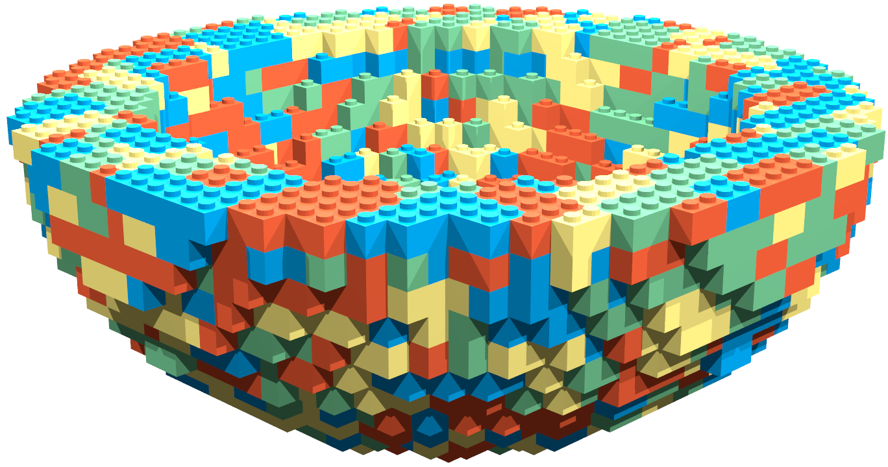

Overview
--------

The field of computational design synthesis involves using computer algorithms to create designs to meet a set of engineering requirements. There are many tools and algorithms available to aid in computational design synthesis[5]. Generative grammars are one broad class of solutions to this problem.

This work uses context-free grammars to represent valid connections between objects. This is somewhat similar in concept to previous grammar systems for generating trees or algae[10]. The generated a language issues commands to a 3D object printer. It moves and rotates an imaginary print head and issues requests to place objects. This is similar to the "turtle interpretation" for L-systems described in [3]:

> The  concept  is  based  on  the idea of an imaginary turtle that walks, turns and draws according to instructions given. At any time the turtle has a current position in  3-space  and  a  heading  vector  (the  forward  direction  of movement). Individual letters in a string are treated as commands. Different  letters  change  position  or  heading,  record  vertices  in  a polygon,  apply  pre-defined  surfaces  to  the  current  position  and orientation, change colour, etc.

A picture is worth a thousand words, so here is a graphical explanation from [7]:

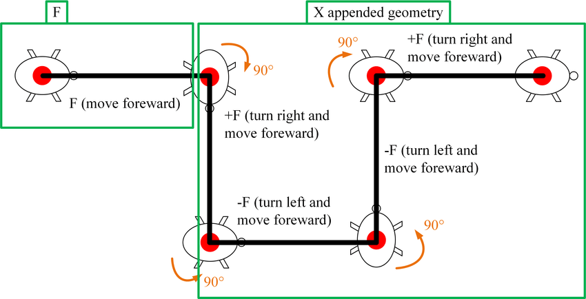

As in other procedural modeling grammar applications [11], non-terminal symbols generically represent opportunities for our grammar to grow new structures.

While context-free grammars are suitable for modeling possible connections, they do not have a concept of global state and cannot "see" the rest of the generated objects. A second layer fitness function, modeling a user-defined global rule set, is required to generate object graphs that adhere to specific global parameters. This is similar to the methods used in other work [1][2]. In the case of simple interconnected shapes, a 3D collision space may be a suitable fitness function to ensure a physically valid shape. Additional rules can be added to ensure that a generated shape is suitable in other ways. For example, rules could be added for thermal dissipation to model behavior of various shapes for use as a heat sink.

Grammar production rules may also be assigned a probability to model possible interconnections as a probabilistic context-free grammar (PCFG). This allows each created model to be unique, and provides a product designer with more tools to enhance their creative work[9].

Complexity
----------

The underlying complexity of this process creates the need for a few optimizations.

### Exponential Brute-force Solution

At the highest level, this algorithm is searching all utterances of a grammar and attempting to find the best fit against a fitness function. Because most CFGs can produce countably infinite valid utterances, we at minimum need some sort of bound on language length.

There are many ways to accomplish this, but there are also some other practical considerations for this problem. Namely, the number of strings generated by a grammar increases exponentially with the allowed string length. Because we have to evaluate each produced string, our total complexity is **O(cⁿ)**.

Exponential complexity is generally intractable, and our case is no exception. Any practical application necessitates a large n and a relatively complex fitness function, so in order for this algorithm to run in reasonable time, we need to make some significant compromises.

### Linear Time Simplification

The simplification that I have chosen to implement for this project is to optimize for local maxima instead of global maxima. This means that we are likely going to miss the best global solution, but we can find a solution in linear time instead of exponential time.

Specifically, we will simply apply the production rule to the left-most non-terminal that produces the best fitness without considering any other possible non-terminals. This would be akin to solving the Traveling Salesman Problem by simply visiting the next closest point on each iteration. This is clearly sub-optimal, but for many applications we can design and organize our grammar rules in a clever way to produce reasonable results.

In particular, grammar rules that are most likely to produce the best global results should be tested first. This both ensures that they win ties, and ensures that they are immediately used in the case that multiple rules return optimal fitness.

The final algorithm for fitting a model to the fitness function is as follows:

1. Initialize a list of symbols containing only the start symbol.
2. Find the left-most non-terminal symbol.
3. Generate a new text by applying a production rule that we have not tried yet.
4. Check the generated text against our fitness function and store the result.
5. Repeat back to (3) for each production rule.
6. Apply the production rule that returned the highest fitness (first rule wins in case of a tie).
7. Repeat back to (2) until the string contains only terminals.

One practical benefit of this algorithm is that it may allow certain types of fitness functions to cache and build on previous results increasing real-world performance. This technique is used in some of the following examples to produce structures with n>3000 in under 15 seconds on modest hardware using a fairly slow interpreted language. This could likely be done in real-time if properly optimized.

Examples
--------

This package and basic algorithm could be used to model many kinds of interconnected structures. For demonstration purposes, I will explore interconnected stud-and-tube-based building blocks such as [4]:

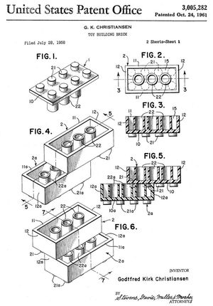

This sort of system is familiar to most people. Using this for demonstration eliminates the need to describe external domain knowledge as part of an explaining this methodology. It also has the convenient side-effect of being a cheap physical object that can be quickly assembled for debugging and problem solving.

Despite its simple appearance, blocks of this nature to provide enough interesting behavior to demonstrate the complexity that can be generated using context-free grammars. For example, blocks may only be stacked, so in order to move laterally multiple blocks must be stacked in an interconnected pattern.

### Stack of Bricks

Trivially, this system can be used to generate a stack of bricks linearly upwards in a single dimension. This simplistic example provides a good starting point for demonstration purposes.

#### Program Generation

The following is a simple grammar that could be used to generate instructions for a basic brick tower:

    Stud -> 'Move(0,-1,0)' 'Place("Brick1x1")' Stud
    Stud -> ɛ

Adding a simple fitness function to return perfect fitness unless we have more than 3 bricks in the model will allow us to generate a placement program. Here are the steps for the generation process:

1. `Stud` (Start symbol in our grammar)
    - 0 Elements
    - Fitness: 1.0
2. `Move(0,-1,0) Place("Brick1x1") Stud`
    - 1 Element
    - Fitness: 1.0
3. `Move(0,-1,0) Place("Brick1x1") Move(0,-1,0) Place("Brick1x1") Stud`
    - 2 Elements
    - Fitness: 1.0
5. `Move(0,-1,0) Place("Brick1x1") Move(0,-1,0) Place("Brick1x1") Move(0,-1,0) Place("Brick1x1") Stud`
    - 3 Elements
    - Fitness: 1.0
6. `Move(0,-1,0) Place("Brick1x1") Move(0,-1,0) Place("Brick1x1") Move(0,-1,0) Place("Brick1x1") Move(0,-1,0) Place("Brick1x1") Stud`
    - 4 Elements
    - Fitness: 0.0
    - Our element list now contains more than three elements, so it fails our simple fitness test.
    - Therefore, we don't apply this production rule and instead try the next one.
7. `Move(0,-1,0) Place("Brick1x1") Move(0,-1,0) Place("Brick1x1") Move(0,-1,0) Place("Brick1x1")`
    - 3 Elements
    - Fitness: 1.0
    - We now have only terminals, so we have generated a complete, valid program.

#### Program Execution

Now that we have the program generated, let's step through the program execution. The only state we need to consider is the current position and the list of placed elements:

1. Program initialization
    - position = (0,0,0)
    - elements = []
2. Execute `Move(0,-1,0)`
    - position = (0,-1,0)
    - elements = []
3. Execute `Place("Brick1x1")`
    - position = (0,-1,0)
    - elements = [("Brick1x1",0,-1,0)]
    - Rendered output: 
    
    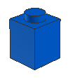
4. Execute `Move(0,-2,0)`
    - position = (0,-2,0)
    - elements = [("Brick1x1",0,-1,0)]
5. Execute `Place("Brick1x1")`
    - position = (0,-2,0)
    - elements = [("Brick1x1",0,-1,0), ("Brick1x1",0,-2,0)]
    - Rendered output: 
    
    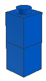
6. Execute `Move(0,-1,0)`
    - position = (0,-3,0)
    - elements = [("Brick1x1",0,-1,0), ("Brick1x1",0,-2,0)]
7. Execute `Place("Brick1x1")`
    - position = (0,-3,0)
    - elements = [("Brick1x1",0,-1,0), ("Brick1x1",0,-2,0), ("Brick1x1",0,-3,0)]
    - Final rendered output:
    
    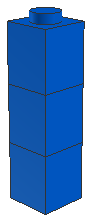

### Stacked Bricks with Rotation and Translation

The stacking example represents some of the basic concepts, but it is a simplification of the complete system. In addition to the above instructions, this system also implements `Rotate` to adjust the direction of the head. `Move` instructions adjust position relative to head direction, and `Place` instructions use head direction to determine the orientation of placed objects. Positions are also stored on a stack and can be pushed and popped in order to simplify grammar and program design.

The state of a running program consists of:

1. A stack of head positions. This is initialized with one position at the origin. A position is represented as a 4-tuple (x, y, z, rotation_matrix). The rotation matrix is a standard 3x3 3D transformation matrix.
2. A list of elements. Elements are represented as a 3-tuple of (position, color, name).

Rotation and translation are important, as connections between these building blocks and many other physical objects depend on connections being made at specific locations and orientations. This applies in many contexts including screws lining up with associated holes in a connected part and surface-mount PCB connectors properly aligning with their mate. Including rotation and translation in our system allows us to model complex connection types in 3D space.
 
#### Program Generation

Consider the following grammar that includes translation in the xz plane as well as head rotation:

    Stud -> 'Move(-2,0,0)' 'Rotate(90)' 'Move(-3,-3,-1)' 'Place(3001)' 'Move(-3,0,-1)' Stud
    Stud -> ɛ

Using the same simple fitness function as before to limit us to three elements, this grammar will generate the following placement program:

```
Move(-2,0,0)
Rotate(90)
Move(-3,-3,-1)
Place(3001)
Move(-3,0,-1)
Move(-2,0,0)
Rotate(90)
Move(-3,-3,-1)
Place(3001)
Move(-3,0,-1)
Move(-2,0,0)
Rotate(90)
Move(-3,-3,-1)
Place(3001)
Move(-3,0,-1)
```

Stepping through the program will generate the following:

1. Execute `Move(-2,0,0) Rotate(90) Move(-3,-3,-1) Place("Brick2x4") Move(-3,0,-1)`

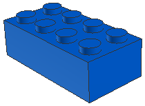

2. Execute `Move(-2,0,0) Rotate(90) Move(-3,-3,-1) Place("Brick2x4") Move(-3,0,-1)`

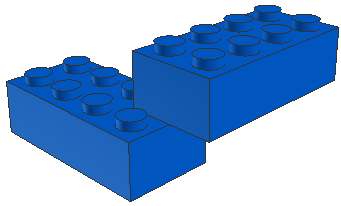

3. Execute `Move(-2,0,0) Rotate(90) Move(-3,-3,-1) Place("Brick2x4") Move(-3,0,-1)`

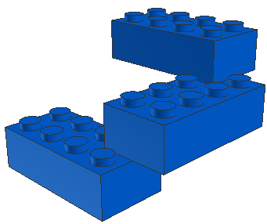

### Filled Bounding Surfaces

The previous examples have used a trivial fitness function that could simply be replaced by generating a string from the grammar of length n. A non-trivial fitness function should use properties of the generated object to determine fitness.

One example would be a fitness function that validates legal collision-free element placement. This can be implemented using any physics simulator, but for simplicity we will simply use an axis-aligned bounding box (AABB) voxel system[8].

Let's begin by significantly expanding our grammar. We'll need two main additions:

1. The ability to add bounds to our geometry. We will implement this via a new `PlaceBoundingBox` operation.
2. The ability for placed elements to actually consume space. We will implement this via a new `FillRect` operation.

We will also use a greatly expanded our grammar for element placement to demonstrate some of the power of this system. The grammars used can be found in the `/examples` directory. Here is an example grammar that includes 1x1, 1x2, 2x2, and 2x4 bricks and implements both stud and antistud connections:

```
Stud -> '(' 'Move(-3,-3,-1)' B2x4 ')'
Stud -> '(' 'Move(-2,0,0)' 'Rotate(90)' 'Move(-3,-3,-1)' B2x4 ')'
Stud -> '(' 'Move(-2,0,0)' 'Rotate(270)' 'Move(-3,-3,-1)' B2x4 ')'
Stud -> '(' 'Move(-2,0,0)' 'Rotate(180)' 'Move(-3,-3,-1)' B2x4 ')'

Stud -> '(' 'Move(-1,-3,-1)' B2x2 ')'
Stud -> '(' 'Rotate(90)' 'Move(-1,-3,-1)' B2x2 ')'
Stud -> '(' 'Rotate(180)' 'Move(-1,-3,-1)' B2x2 ')'
Stud -> '(' 'Rotate(270)' 'Move(-1,-3,-1)' B2x2 ')'

Stud -> '(' 'Move(-1,-3,0)' B1x2 ')'
Stud -> '(' 'Rotate(90)' 'Move(-1,-3,0)' B1x2 ')'
Stud -> '(' 'Rotate(270)' 'Move(-1,-3,0)' B1x2 ')'
Stud -> '(' 'Rotate(180)' 'Move(-1,-3,0)' B1x2 ')'

Stud -> '(' 'Move(0,-3,0)' B1x1 ')'
Stud ->

Antistud -> '(' 'Move(-3,0,-1)' B2x4 ')'
Antistud -> '(' 'Move(-2,0,0)' 'Rotate(90)' 'Move(-3,0,-1)' B2x4 ')'
Antistud -> '(' 'Move(-2,0,0)' 'Rotate(270)' 'Move(-3,0,-1)' B2x4 ')'
Antistud -> '(' 'Move(-2,0,0)' 'Rotate(180)' 'Move(-3,0,-1)' B2x4 ')'

Antistud -> '(' 'Move(-1,0,-1)' B2x2 ')'
Antistud -> '(' 'Rotate(90)' 'Move(-1,0,-1)' B2x2 ')'
Antistud -> '(' 'Rotate(270)' 'Move(-1,0,-1)' B2x2 ')'
Antistud -> '(' 'Rotate(180)' 'Move(-1,0,-1)' B2x2 ')'

Antistud -> '(' 'Move(-1,0,0)' B1x2 ')'
Antistud -> '(' 'Rotate(90)' 'Move(-1,0,0)' B1x2 ')'
Antistud -> '(' 'Rotate(180)' 'Move(-1,0,0)' B1x2 ')'
Antistud -> '(' 'Rotate(270)' 'Move(-1,0,0)' B1x2 ')'
Antistud -> '(' B1x1 ')'
Antistud -> 

B2x4 -> 'FillRect(8,3,4)' 'Place(3001)' BrickConnection2x4
B2x2 -> 'FillRect(4,3,4)' 'Place(3003)' BrickConnection2x2
B1x2 -> 'FillRect(4,3,2)' 'Place(3004)' BrickConnection1x2
B1x1 -> 'FillRect(2,3,2)' 'Place(3005)' BrickConnection

BrickConnection -> '(' Stud 'Move(0,3,0)' Antistud ')' |
BrickConnection1x2 -> '(' 'Move(-1,0,0)' BrickConnection 'Move(2,0,0)' BrickConnection ')'
BrickConnection2x2 -> '(' 'Move(0,0,-1)' BrickConnection1x2 'Move(0,0,2)' BrickConnection1x2 ')'
BrickConnection2x4 -> '(' 'Move(-2,0,0)' BrickConnection2x2 'Move(4,0,0)' BrickConnection2x2 ')'
```

Let's expand that grammar to fill the inside of a bounding box:

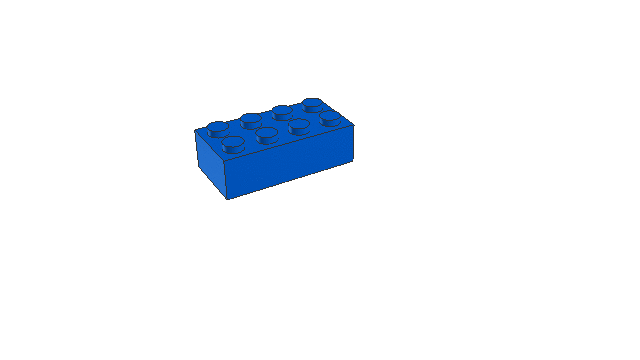

We can see that the grammar is able to fill the entire bounding box with bricks in a legally connected structure. Let's try a bounding sphere to see if we are able to fill a structure that doesn't align quite so nicely to our axis-aligned voxel world:

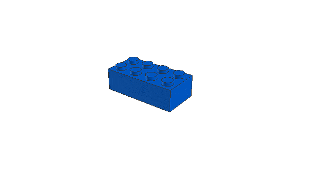

That works fine as well. By combining bounding boxes and bounding spheres, we can build some fairly complex shapes, such as this dish:

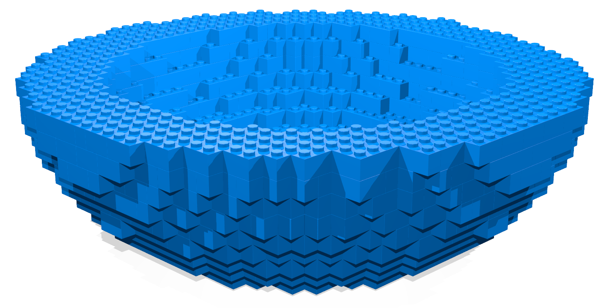

### Castle

Now let's try to actually make something that looks like a real-world object. Castle walls are easily recognizable, so let's start there.

We can build a basic wall by simply filling in a narrow bounding box. We can add battlements to the top by adding additional bounding boxes at the top in regular intervals. We can also clean up the studded look on top by adding a few tiles to our grammar:

```
Stud -> '(' 'Move(-1,-1,0)' T1x2 ')'
Stud -> '(' 'Rotate(90)' 'Move(-1,-1,0)' T1x2 ')'
Stud -> '(' 'Rotate(180)' 'Move(-1,-1,0)' T1x2 ')'
Stud -> '(' 'Rotate(270)' 'Move(-1,-1,0)' T1x2 ')'
Stud -> '(' 'Move(0,-1,0)' T1x1 ')'

T1x1 -> 'FillRect(2,1,2)' 'Place(3070b)'
T1x2 -> 'FillRect(4,1,2)' 'Place(3069b)' '(' 'Move(-1,1,0)' Antistud 'Move(2,1,0)' ')'
```

This produces a fine, though admittedly boring, wall:

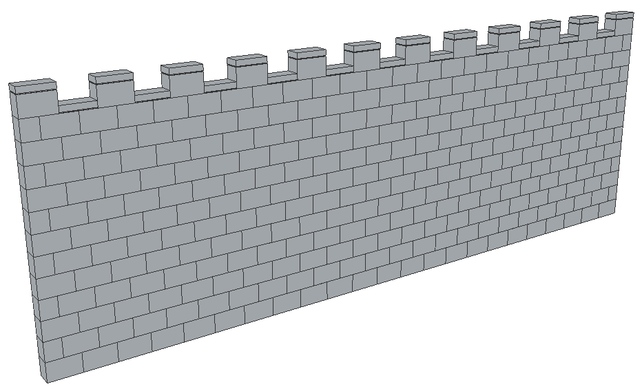

### Rock Face

This system optionally supports probabilistic context-free grammar rules. These function the same as regular production rules, but they have probabilities assigned to them and are randomly used instead of being matched against the fitness function. Probabilistic rules are assumed to all produce equal fitness but may adjust the aesthetic qualities of the structure.

Here is an example ruleset to construct a wall with the irregular appearance of a sheer rock face as [requested on Bricks Stack Exchange](https://bricks.stackexchange.com/q/9766/708):
    
    RockSingleStud -> 'FillRect(2,9,2)' RockSingleTall
    RockSingleStud -> 'FillRect(2,3,2)' 'Place(3040)' '(' 'Move(0,3,0)' RockDoubleStud ')'
    RockSingleStud -> 'FillRect(2,3,2)' 'Place(3005)' '(' 'Move(0,3,0)' RockSingleStud ')'
    RockSingleStud ->
    
    RockSingleTall -> 'Place(4460)' '(' 'Move(0,9,0)' RockDoubleStud ')' [.25]
    RockSingleTall -> S1x2 '(' 'Move(0,3,0)' B1x2  'Move(0,3,0)' B1x2 'Move(0,3,0)' RockDoubleStud ')' [.25]
    RockSingleTall -> B1x1 '(' 'Move(0,3,0)' S1x2  'Move(0,3,0)' B1x2 'Move(0,3,0)' RockDoubleStud ')' [.25]
    RockSingleTall -> B1x1 '(' 'Move(0,3,0)' B1x1  'Move(0,3,0)' S1x2 'Move(0,3,0)' RockDoubleStud ')' [.25]
    RockSingleTall -> [0.0]
    
    RockDoubleStud -> 'FillRect(2,9,2)' RockDoubleTall '(' 'Move(0,9,0)' RockSingleStud ')'
    RockDoubleStud -> 'FillRect(2,3,2)' SI1x2 '(' 'Move(0,3,0)' RockSingleStud ')'
    RockDoubleStud ->
    
    RockDoubleTall -> 'Place(2449)' '(' 'Move(0,9,0)' RockSingleStud ')' [.25]
    RockDoubleTall -> SI1x2 '(' 'Move(0,3,0)' B1x1  'Move(0,3,0)' B1x1 'Move(0,3,0)' RockSingleStud ')' [.25]
    RockDoubleTall -> B1x2 '(' 'Move(0,3,0)' SI1x2  'Move(0,3,0)' B1x1 'Move(0,3,0)' RockSingleStud ')' [.25]
    RockDoubleTall -> B1x2 '(' 'Move(0,3,0)' B1x2  'Move(0,3,0)' SI1x2 'Move(0,3,0)' RockSingleStud ')' [.25]
    RockDoubleTall -> [0.0]

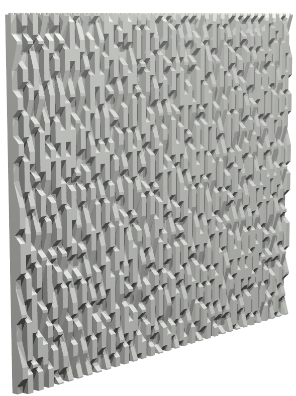

This example can be generated by running `make rock`.

### Probabilistic Castle

We were already able to create a reasonable castle wall in a previous example. Let's see if we can add some interest by applying new probabilistic grammar rules:

```
B1x2 -> 'FillRect(4,3,2)' 'SetColor(378)' 'Place(3004)' 'SetColor(71)' BrickConnection1x2 [.1]
B1x2 -> 'FillRect(4,3,2)' 'Place(3004)' BrickConnection1x2 [.7]
B1x2 -> 'FillRect(4,3,2)' 'SetColor(72)' 'Place(98283)' 'SetColor(71)' BrickConnection1x2 [.15]
B1x2 -> 'FillRect(4,3,2)' '(' 'Move(-1,0,0)' B1x1NoCheck 'Move(2,0,0)' B1x1NoCheck ')' [.05]
B1x1 -> 'FillRect(2,3,2)' B1x1NoCheck

B1x1NoCheck -> 'Place(3005)' BrickConnection [.3]
B1x1NoCheck -> 'Place(3062b)' BrickConnection [.6]
B1x1NoCheck -> 'Place(47905)' BrickConnection [.1]
```

Each rule now has an associated probability that indicates how frequently it should be applied. Regenerating our castle wall using these new rules gives us something like this:

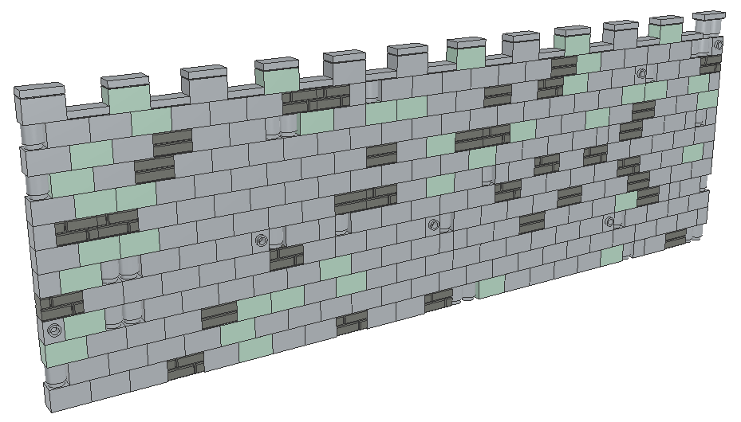

That's much more interesting than the plain wall. This type of probabilistic rule-based design could be applied to many areas of product development and design to create new product alterations.

This example can be generated by running `make castle`.

### Augmented Human Design Example

One of the beautiful attributes of a grammar-based methodology is that it allows us to store the entire state of the design in an expandable connection grammar utterance. This allows us to easily move back and forth between human CAD design and computer procedural generation.

Let's say that a designer has a particular design in mind for an aspect of a product that is tedious to model as a grammar but trivial to model with traditional CAD tools. A designer can simply create a section of the design in a CAD tool, convert it to a grammar, and grow new structures from there. Take for example this drawbridge design:

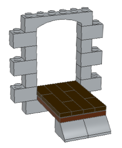

This was designed using LDraw and stored as a simple list of elements. However, it can be easily converted into the following grammar utterance:

```
( Move(-5,3,0) FillRectNoCheck(4,3,2) )
( Move(-5,9,0) Rotate(180) FillRectNoCheck(4,3,2) )
( Move(7,3,0) Rotate(180) FillRectNoCheck(4,3,2) )
( Move(7,9,0) FillRectNoCheck(4,3,2) )
( Move(7,15,0) Rotate(180) FillRectNoCheck(4,3,2) )
( Move(-5,15,0) FillRectNoCheck(4,3,2) )
( Move(6,12,0) Rotate(180) FillRectNoCheck(2,3,2) )
( Move(6,6,0) Rotate(180) FillRectNoCheck(2,3,2) )
( Move(-4,6,0) Rotate(180) FillRectNoCheck(2,3,2) )
( Move(-4,12,0) Rotate(180) FillRectNoCheck(2,3,2) )
( Move(-5,3,0) SetColor(71) B1x2NoCheck )
( Move(-5,9,0) SetColor(71) Rotate(180) B1x2NoCheck )
( Move(7,3,0) SetColor(71) Rotate(180) B1x2NoCheck )
( Move(7,9,0) SetColor(71) B1x2NoCheck )
( Move(7,15,0) SetColor(71) Rotate(180) B1x2NoCheck )
( Move(-5,15,0) SetColor(71) B1x2NoCheck )
( Move(1,18,0) SetColor(71) Rotate(180) Place(3009) )
( Move(6,12,0) SetColor(71) Rotate(180) B1x1NoCheck )
( Move(6,6,0) SetColor(71) Rotate(180) B1x1NoCheck )
( Move(-4,6,0) SetColor(71) Rotate(180) B1x1NoCheck )
( Move(-4,12,0) SetColor(71) Rotate(180) B1x1NoCheck )
( Move(1,0,0) SetColor(71) Place(92950) )
( Move(1,17,-5) SetColor(70) Rotate(270) Place(3032) )
( Move(-1,18,-10) SetColor(71) Place(6227) )
( Move(3,18,-10) SetColor(71) Place(6227) )
( Move(-2,16,-7) SetColor(308) Rotate(270) Place(91143) )
( Move(2,16,-7) SetColor(308) Rotate(270) Place(91143) )
( Move(0,16,-3) SetColor(308) Rotate(270) Place(91143) )
( Move(4,16,-3) SetColor(308) Rotate(270) Place(91143) )
( Move(4,16,-9) SetColor(308) Rotate(270) Place(30070) )
( Move(-2,16,-1) SetColor(308) Rotate(270) Place(30070) )
( Move(2,16,-1) SetColor(308) Rotate(270) Place(30070) )
( Move(0,16,-9) SetColor(308) Rotate(270) Place(30070) )
SetColor(71)
```

We can then expand this within the bounds of our previous wall and generate a wall surrounding our drawbridge:

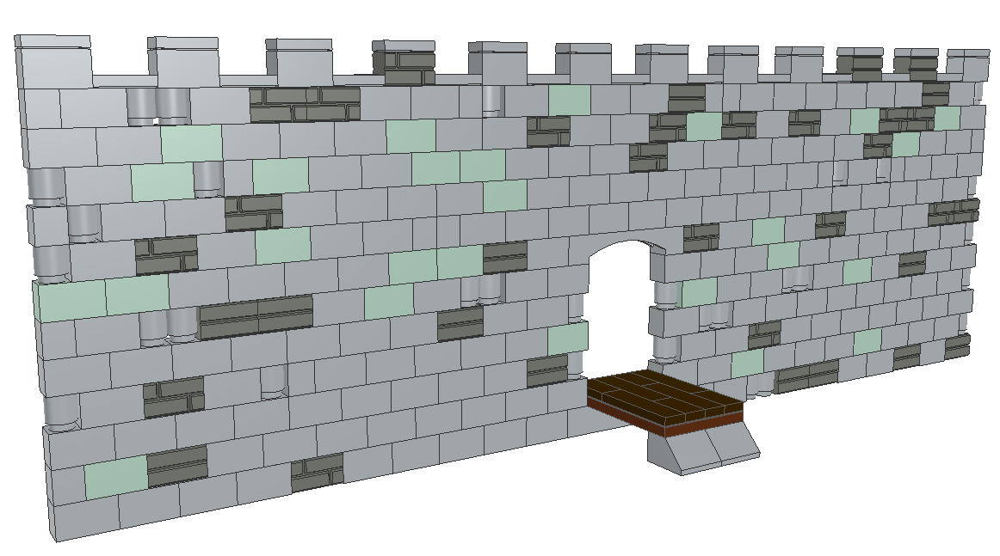

Here's an animation to show the order in which the grammar fulfills connections:

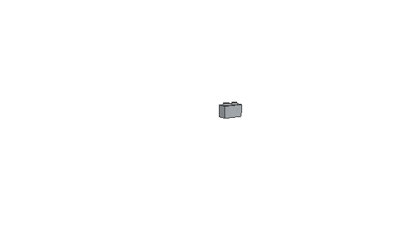

Let's not forget that this system can operate in full 3D space, so we can generate a much more defensible castle by simply adjusting the bounds in our fitness function:

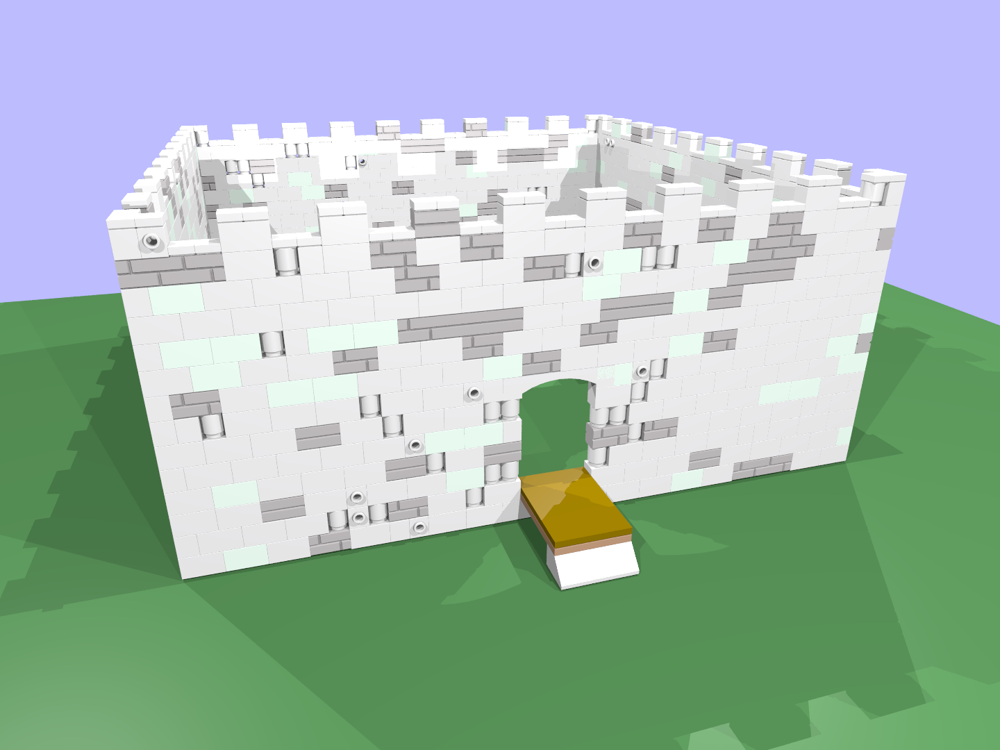

Using this human augmentation technique, multiple hand-designed structures can be stitched together using a grammar that understands possible connections between them.

This example can be generated by running `make augcastle`.

### Height Map Example

We can get creative with our fitness function in order to create all kinds of novel structures. For example, we could build a topographical map of an area by building a fitness function from a height map such as this one:

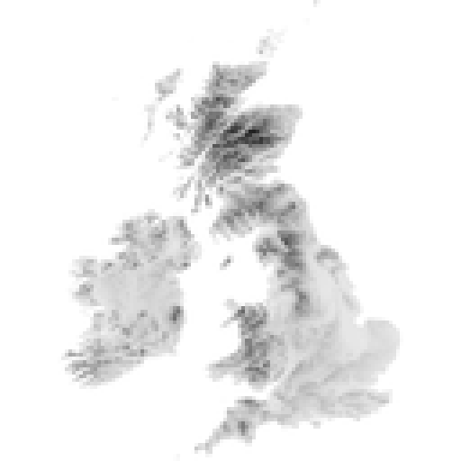

The fitness function is then able to generate a program to build the following with the addition of altitude-based coloring rules:

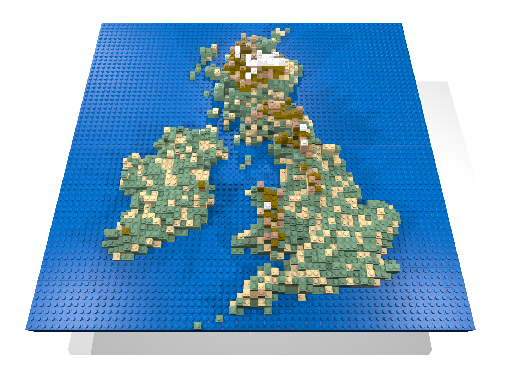

Alternative Approaches
----------------------

One alternative approach in using grammars to represent physical objects is to have the grammar operate on literal shapes[6]. These systems are referred to as shape grammars. This package does not implement shape grammars. Instead, it uses a text grammar to build a language that is interpreted to build up a set of objects. A shape grammar could be applied to solve these issues and may lead to simplifications of the algorithms.

Future Work
-----------

This system takes several shortcuts that could be addressed more completely.

The simplistic local optimization function could be replaced by something more robust such as gradient descent or [simulated annealing](https://en.wikipedia.org/wiki/Simulated_annealing)[12]. Brute force search could be implemented for applications where n is small.

The included sample grammars and fitness function could be enhanced to handle additional complexity. One basic augmentation would be to enhance the rotation operation to operate in full 3D space instead of simple rotation about the vertical axis in the cardinal directions.

Additional grammars and fitness functions could be included to demonstrate the utility of this methodology in other areas such as circuit design, IC layout, and nano technology. One option could be to replicated prior work generating MEMS resonators with a shape grammar[13].

Exploring how to integrate methods like this one into the UX of existing CAD products is also an ongoing area of research[5].

References
----------

[1] Martin, Jess. "Procedural house generation: A method for dynamically generating floor plans." In Symposium on interactive 3D Graphics and Games, vol. 2. 2006.

[2] Krecklau, Lars, and Leif Kobbelt. "Procedural modeling of interconnected structures." In Computer Graphics Forum, vol. 30, no. 2, pp. 335-344. Blackwell Publishing Ltd, 2011.

[3] McCormack, Jon. "Interactive evolution of L-system grammars for computer graphics modelling." Complex Systems: from biology to computation 2 (1993).

[4] Christiansen, Godtfred. 1961. Toy Building Brick. U.S. Patent 3,005,282, filed July 28, 1958, and issued October 24, 1961.

[5] Chakrabarti, Amaresh, Kristina Shea, Robert Stone, Jonathan Cagan, Matthew Campbell, Noe Vargas Hernandez, and Kristin L. Wood. "Computer-based design synthesis research: an overview." Journal of Computing and Information Science in Engineering 11, no. 2 (2011): 021003.

[6] Stiny, George, and James Gips. "Shape Grammars and the Generative Specification of Painting and Sculpture." In IFIP Congress (2), vol. 2, no. 3. 1971.

[7] Bie, Dongyang, Jie Zhao, Xiaolu Wang, and Yanhe Zhu. "A distributed self-reconfiguration method combining cellular automata and L-systems." In Robotics and Biomimetics (ROBIO), 2015 IEEE International Conference on, pp. 60-65. IEEE, 2015.

[8] Jiménez, Pablo, Federico Thomas, and Carme Torras. "3D collision detection: a survey." Computers & Graphics 25, no. 2 (2001): 269-285.

[9] Lienhard, Stefan, Cheryl Lau, Pascal Müller, Peter Wonka, and Mark Pauly. "Design Transformations for Rule‐based Procedural Modeling." In Computer Graphics Forum, vol. 36, no. 2, pp. 39-48. 2017.

[10] Aono, Masaki, and Tosiyasu L. Kunii. "Botanical tree image generation." IEEE computer graphics and applications 4, no. 5 (1984): 10-34.

[11] Krecklau, Lars, Darko Pavic, and Leif Kobbelt. "Generalized Use of Non‐Terminal Symbols for Procedural Modeling." In Computer Graphics Forum, vol. 29, no. 8, pp. 2291-2303. Blackwell Publishing Ltd, 2010.

[12] Kirkpatrick, Scott, C. Daniel Gelatt, and Mario P. Vecchi. "Optimization by simulated annealing." science 220, no. 4598 (1983): 671-680.

[13] Agarwal, Manish, Jonathan Cagan, and George Stiny. "A micro language: generating MEMS resonators by using a coupled form—function shape grammar." Environment and Planning B: Planning and Design 27, no. 4 (2000): 615-626.

[14] Campbell, Matthew I., and Kristina Shea. “Computational Design Synthesis.” Artificial Intelligence for Engineering Design, Analysis and Manufacturing 28, no. 3 (2014): 207–8. doi:10.1017/S0890060414000171.
