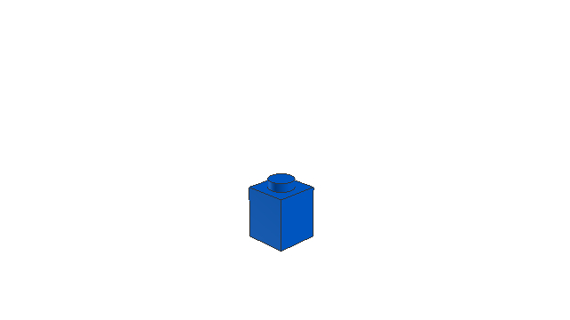
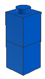
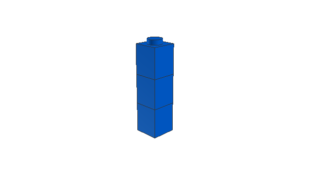

Connection Grammar
==================

Overview
--------

The field computational design synthesis involves using computer algorithm to create designs to meet a set of engineering requirements. There are many tools and algorithms available to aid in computational design synthesis[5]. Generative grammars are one broad class of solutions to this problem.

This package provides a way to develop text grammars that represent a language of interconnected 3D objects in a Python environment.

One approach in using grammars to represent physical objects is to have the grammar operate on literal shapes[6]. These systems are referred to as shape grammars. This package does not implement shape grammars. Instead, it uses a text grammar to build a language that is interpretted to build up a set of objects.

Specifically, the context-free grammar generates a language that can be seen as issuing commands to a 3D object printer. It moves and rotates an imaginary print head and issues requests to place objects. This grammar is bracketed to enable pusing and popping of print head position. This is similar to the "turtle interpretation" for L-systems desribed in [3]:

> The  concept  is  based  on  the idea of an imaginary turtle that walks, turns and draws according to instructions given. At any time the turtle has a current position in  3-space  and  a  heading  vector  (the  forward  direction  of movement). Individual letters in a string are treated as commands. Different  letters  change  position  or  heading,  record  vertices  in  a polygon,  apply  pre-defined  surfaces  to  the  current  position  and orientation, change colour, etc.   The  concept  is  based  on  the idea of an imaginary turtle that walks, turns and draws according to instructions given. At any time the turtle has a current position in  3-space  and  a  heading  vector  (the  forward  direction  of movement). Individual letters in a string are treated as commands. Different  letters  change  position  or  heading,  record  vertices  in  a  polygon,  apply  pre-defined  surfaces  to  the  current  position  and orientation, change colour, etc.

The system operates in two parts. While context-free grammars are suitable for modelling possible connections, they do not have a concept of global state and cannot "see" the rest of the generated objects. The context-free grammar production rules serve to model possible interconnections between sub-objects. A second layer fitness function, modeling a user-defined global ruleset, is required to generate object graphs that adhere to specific global parameters. This is similar to the methods used in other work [1][2]. In the case of simple interconnected shapes, a 3D collision space is a suitable fitness function to ensure a physically valid shape. Additional rules can be added to this layer to ensure that a generated shape is suitable in other ways. For example, rules could be added for thermal disipation to model behavior of various shapes for use as a heat exchanger.

The grammar has one special constraint place upon it. Every non-terminal must be able to be converted to a terminal via a single production rule. This allows the grammar to be checked against the fitness function after each production rule application. The algorithm for fitting a model to the fitness function is as follows:

1. Go to the left-most non-terminal.
2. Generate a text by applying first production rule that we have not tried yet.
3. Check the generated text against our fitness function and store the result.
4. Repeat back to (2) for each production rule.
5. Apply the production rule that returned the highest fitness (first rule wins in case of a tie).
6. Repeat back to (1) until the string contains only terminals.

This package and basic algorithm could be used to model many kinds of interconnected structures. For demonstration purposes, I will explore interconnected stud-and-tube-based building blocks such as [4]:

This sort of system is familiar to most people. Using this for demonstration eliminates the need to describe external domain knowledge as part of an explaining this methodology. It also has the convienient side-effect of being a cheap physical object that can be quickly physcially assembled for debugging and problem solving issues.

Despite its simple appearance, blocks of this nature to provide enough interesting behavior to demonstrate the complexity that can be generated using context-free grammars. For example, blocks may only be stacked, so in order to move laterally multiple blocks must be stacked in an interconnected pattern.

Example
-------

Here's a very simple example grammar that could be used to generate instructions for a simple brick tower:

    Stud -> 'Move(0,-1,0)' 'Place("Brick1x1")' Stud
    Stud -> ɛ

Adding a simple fitness function to return perfect fitness unless we have more than 3 bricks in the model will allow us to generate a placement program. Here are the steps for the generation process:

1. `Stud` (Start symbol in our grammar)
    - 0 Elements
    - Fitness: 1.0
2. `Move(0,-1,0) Place("Brick1x1") Stud`
    - 1 Element
    - Fitness: 1.0
3. `Move(0,-1,0) Place("Brick1x1") Move(0,-1,0) Place("Brick1x1") Stud`
    - 2 Elements
    - Fitness: 1.0
5. `Move(0,-1,0) Place("Brick1x1") Move(0,-1,0) Place("Brick1x1") Move(0,-1,0) Place("Brick1x1") Stud`
    - 3 Elements
    - Fitness: 1.0
6. `Move(0,-1,0) Place("Brick1x1") Move(0,-1,0) Place("Brick1x1") Move(0,-1,0) Place("Brick1x1") Move(0,-1,0) Place("Brick1x1") Stud`
    - 4 Elements
    - Fitness: 0.0
    - Our element list now contains more than three elements, so it fails our simple fitness test.
    - Therefore, we don't apply this production rule and instead try the next one.
7. `Move(0,-1,0) Place("Brick1x1") Move(0,-1,0) Place("Brick1x1") Move(0,-1,0) Place("Brick1x1")`
    - 3 Elements
    - Fitness: 1.0
    - We now have only terminals, so we have generated a complete valid program.

Now that we have the program generated, let's step through the program execution. The only state we need to consider is the current postion and the list of placed elements:

1. Program initialization
    - position = (0,0,0)
    - elements = []
2. Execute `Move(0,-1,0)`
    - position = (0,-1,0)
    - elements = []
3. Execute `Place("Brick1x1")`
    - position = (0,-1,0)
    - elements = [("Brick1x1",0,-1,0)]
    - Rendered output: 
    
    
4. Execute `Move(0,-2,0)`
    - position = (0,-2,0)
    - elements = [("Brick1x1",0,-1,0)]
5. Execute `Place("Brick1x1")`
    - position = (0,-2,0)
    - elements = [("Brick1x1",0,-1,0), ("Brick1x1",0,-2,0)]
    - Rendered output: 
    
    
6. Execute `Move(0,-1,0)`
    - position = (0,-3,0)
    - elements = [("Brick1x1",0,-1,0), ("Brick1x1",0,-2,0)]
7. Execute `Place("Brick1x1")`
    - position = (0,-3,0)
    - elements = [("Brick1x1",0,-1,0), ("Brick1x1",0,-2,0), ("Brick1x1",0,-3,0)]
    - Final rendered output:
    
    

The above example represents the basic concept, but is simplification of the complete system. In addition to the above instructions, this system also implements `Rotate` to adjust the direction of the head. `Move` is relative to head direction, and head direction also determines the orientation of placed objects. Positions are also represented on a stack and can be pushed and popped in order to simplify program design.

The state of a running program consists of:

1. A stack of head positions. This is initialized with one position at the origin. A position is represented as a 4-tuple (x, y, z, rotation_matrix). The rotation matrix is a standard 3x3 3D transformation matrix.
2. A list of elements. Elements are represented as a 3-tuple of (position, color, name).

[1] Martin, Jess. "Procedural house generation: A method for dynamically generating floor plans." In Symposium on interactive 3D Graphics and Games, vol. 2. 2006.

[2] Krecklau, Lars, and Leif Kobbelt. "Procedural modeling of interconnected structures." In Computer Graphics Forum, vol. 30, no. 2, pp. 335-344. Blackwell Publishing Ltd, 2011.

[3] McCormack, Jon. "Interactive evolution of L-system grammars for computer graphics modelling." Complex Systems: from biology to computation 2 (1993).

[4] Christiansen, Godtfred. 1961. Toy Building Brick. U.S. Patent 3,005,282, filed July 28, 1958, and issued October 24, 1961.

[5] Chakrabarti, Amaresh, Kristina Shea, Robert Stone, Jonathan Cagan, Matthew Campbell, Noe Vargas Hernandez, and Kristin L. Wood. "Computer-based design synthesis research: an overview." Journal of Computing and Information Science in Engineering 11, no. 2 (2011): 021003.

[6] Stiny, George, and James Gips. "Shape Grammars and the Generative Specification of Painting and Sculpture." In IFIP Congress (2), vol. 2, no. 3. 1971.
